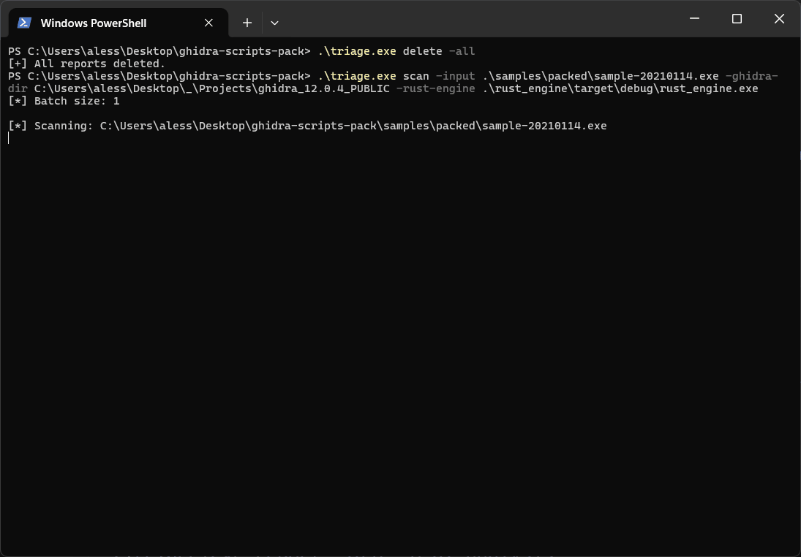

# Ghidra Malware Triage Framework

A modular automated static-analysis framework for malware triage built around **Ghidra**, **Go**, **Rust**, and an optional **local AI-assisted analysis layer**.

<p align="center">
  
</p

<p align="center">
  <i>Binary → Ghidra extraction → Rust enrichment → AI-assisted triage → Markdown / JSON analyst output</i>
</p>

The project is designed to simulate a realistic malware triage workflow on PE samples by combining static extraction, scoring, capability inference, packer heuristics, function prioritization, and optional AI-generated analyst summaries.

---

## TL;DR

This project provides an automated malware triage pipeline that:

- extracts structured static-analysis data directly from Ghidra
- scores suspicious behavior and inferred capabilities
- distinguishes **malware risk** from **packing risk**
- highlights suspicious functions for manual review
- produces structured **JSON** and **Markdown** reports
- supports a local **AI-assisted triage layer** using Ollama
- offers a reusable CLI workflow for repeated analysis and tuning

It is not a single Ghidra script or a one-off malware parser.

It is a **modular static malware triage framework**.

---

## What makes this non-trivial

Unlike a simple static extractor, this project focuses on the full triage workflow:

- structured extraction directly from Ghidra APIs
- capability inference from APIs, strings, and local function evidence
- per-function scoring and suspicious-function ranking
- behavior reconstruction through call relationships and role inference
- packer-oriented heuristics including entropy, entrypoint profiling, and OEP candidates
- split reasoning between **observable malware behavior** and **packing / visibility limitations**
- Rust-based enrichment and rule-driven score calibration
- optional AI-assisted analyst summaries built on top of the structured report
- reusable CLI workflow for scanning, inspecting, diffing, exporting, and iterating

The repository is built as a reusable framework rather than a single script dump.

---

## Why this project

The goal of this repository is to demonstrate a realistic static malware triage workflow rather than a single classifier or isolated proof of concept.

The pipeline is meant to show how a binary can move through a complete triage lifecycle:

1. analyze the binary in Ghidra headless mode
2. extract a stable structured report
3. enrich the report through external Rust logic
4. classify risk and capabilities conservatively
5. identify suspicious functions and analyst targets
6. optionally generate AI-assisted triage summaries locally
7. export human-readable and machine-readable artifacts

The result is a portfolio-ready framework focused on:

- static triage
- explainability
- workflow ergonomics
- local reproducibility

---

## Key features

- Ghidra-based static extraction
- structured JSON contract
- function-level scoring and enrichment
- suspicious API detection
- string-based semantic tagging
- capability inference
- lightweight callgraph / behavior reconstruction
- top suspicious function prioritization
- entropy and section profiling
- entrypoint and OEP candidate analysis
- packer-family hints and packed-sample cautioning
- Rust-based enrichment and calibration
- malware-risk vs packing-risk split
- Markdown and JSON report export
- CLI workflow for scan / inspect / diff / state / cleanup
- optional local AI-assisted analysis via Ollama
- no cloud dependency required for AI mode

---

## Architecture overview
```text
Binary
  ↓
Go CLI (triage)
  ↓
Ghidra analyzeHeadless / pyghidraRun
  ↓
Python exporter (ghidra_scripts/export_report.py)
  ↓
raw_report.json
  ↓
Rust engine (score calibration + enrichment + risk split)
  ↓
enriched_report.json
  ↓
optional AI layer (local Ollama / OpenAI-compatible endpoint)
  ↓
ai_analysis / AI-only sidecar
  ↓
JSON / Markdown / inspect workflow
```

---

## Design decisions

- **Ghidra** is the primary extraction layer because it provides rich static-analysis APIs and native access to symbols, functions, strings, entrypoints, and sections
- **Go** is used as the orchestrator to keep the CLI, workflow automation, and report handling lightweight and portable
- **Rust** is used for deterministic enrichment, score calibration, and rules-based reasoning separate from the extraction layer
- the **AI layer is optional** and built on top of structured reports rather than raw binaries
- the AI integration uses a **local OpenAI-compatible endpoint** so the project can stay public, reproducible, and usable without private API keys
- rules are externalized so tuning does not require hardcoding every decision into the core logic

---

## Trade-offs

- this is a **static** triage framework, not a dynamic sandbox
- packer analysis is heuristic-based and may require manual validation
- AI output is intentionally constrained and conservative, but still depends on the quality of the local model
- some benign desktop/system tools can still produce mixed static signals and need manual review
- the framework prioritizes explainability and modularity over maximal speed

---

## Repository layout
```text
cmd/triage/                 Go CLI entrypoint
internal/                   Go orchestration, report handling, AI integration
ghidra_scripts/             Ghidra Python extraction logic
rust_engine/                Rust enrichment engine
rules/                      external Python and Rust rule files
reports/                    generated raw / enriched / AI / Markdown reports
samples/                    local validation samples
run.ps1                     legacy / helper PowerShell workflow
.runstate.json              persisted CLI state
```

---

## Technology stack

- **Ghidra** for static extraction
- **Python** for exporter logic inside Ghidra
- **Go** for orchestration and CLI workflow
- **Rust** for enrichment, scoring, and risk-split logic
- **Ollama** for optional local AI-assisted analysis

---

## Quick start

### 1. Build the Go CLI
```powershell
go build .\cmd\triage
```

### 2. Build the Rust engine
```powershell
cargo build --manifest-path .\rust_engine\Cargo.toml
```

### 3. Run a scan
```powershell
.\triage.exe scan -input .\samples\notMalicious\notepad.exe -ghidra-dir C:\Users\aless\Desktop\_\Projects\ghidra_12.0.4_PUBLIC -rust-engine .\rust_engine\target\debug\rust_engine.exe
```

### 4. View the latest report
```powershell
.\triage.exe report -last
```

### 5. Inspect the Rust enrichment block
```powershell
.\triage.exe inspect -last -rust
```

### 6. Export Markdown
```powershell
.\triage.exe markdown -last
```

---

## Main commands

### Core analysis
```powershell
.\triage.exe scan -input .\samples\notMalicious\notepad.exe -ghidra-dir C:\Users\aless\Desktop\_\Projects\ghidra_12.0.4_PUBLIC
.\triage.exe scan -input .\samples\packed\sample-20210114.exe -ghidra-dir C:\Users\aless\Desktop\_\Projects\ghidra_12.0.4_PUBLIC -rust-engine .\rust_engine\target\debug\rust_engine.exe
.\triage.exe fast -ghidra-dir C:\Users\aless\Desktop\_\Projects\ghidra_12.0.4_PUBLIC
```

### Report viewing
```powershell
.\triage.exe reports
.\triage.exe report -last
.\triage.exe report -last -o summary
.\triage.exe report -last -o rust_enrichment
.\triage.exe report -last -o ai_analysis
.\triage.exe markdown -last
.\triage.exe open -last
```

### Inspect workflow
```powershell
.\triage.exe inspect -last -function entry
.\triage.exe inspect -last -capability process_injection
.\triage.exe inspect -last -packer
.\triage.exe inspect -last -strings
.\triage.exe inspect -last -rust
.\triage.exe inspect -last -ai
```

### Utility workflow
```powershell
.\triage.exe diff -left old_raw.json -right new_raw.json
.\triage.exe state
.\triage.exe delete -last
.\triage.exe delete -all
```

---

## AI-assisted analysis

The project includes an optional local AI-assisted analysis layer that works on top of the structured enriched report.

The AI layer is not used to replace the rule-based engine. Instead, it is used to provide:

- executive triage summaries
- technical summaries
- triage recommendations
- suspicious function prioritization
- analyst questions
- confidence notes

### Why local AI

The repository is designed to be public and usable by others without requiring private cloud API keys. For that reason, the AI integration is built around a local OpenAI-compatible endpoint, with Ollama as the primary target setup.

### Recommended model
```text
qwen2.5:1.5b
```

This was the most stable small local model during integration and testing for JSON-like structured outputs.

### Install Ollama

Install Ollama locally on Windows and ensure the API is reachable on:
```text
http://127.0.0.1:11434/v1
```

Then pull the model:
```powershell
ollama pull qwen2.5:1.5b
```

### Configure environment variables
```powershell
$env:TRIAGE_AI_BASE_URL="http://127.0.0.1:11434/v1"
$env:TRIAGE_AI_MODEL="qwen2.5:1.5b"
$env:TRIAGE_AI_TIMEOUT_SECONDS="300"
Remove-Item Env:TRIAGE_AI_API_KEY -ErrorAction SilentlyContinue
```

### Generate AI-only report
```powershell
.\triage.exe reportAI -last
```

This generates an AI-only sidecar report:
```text
<report_name>_ai.json
```

### Merge AI output into the main report
```powershell
.\triage.exe reportAI -last -merge
```

This updates the source enriched report with:
```json
"ai_analysis": { ... }
```

and regenerates the Markdown report.

---

## Output model

### Raw report

Generated by the Ghidra/Python layer and contains:

- metadata
- sample information
- suspicious APIs
- strings
- capability matches
- function analysis
- behavior analysis
- packer analysis
- analyst-oriented static outputs

### Enriched report

Generated after Rust enrichment and adds:

- calibrated scoring
- derived capabilities
- confidence notes
- malware-risk vs packing-risk split
- decision summary

### AI-only sidecar

Generated by `reportAI` and contains:

- source report reference
- local AI provider info
- AI usage metadata
- structured AI triage block

### Markdown report

Human-readable summary combining:

- static extraction
- enrichment
- packer interpretation
- suspicious functions
- analyst guidance
- optional AI analysis

---

## Example workflow

A typical workflow looks like:

1. analyze a sample with `scan`
2. inspect the generated report
3. inspect the packer block or suspicious functions
4. generate Markdown export
5. optionally run `reportAI`
6. merge AI output into the enriched report
7. use the final report as triage material for manual review

This mirrors a realistic static malware triage process rather than a one-shot classification script.

---

## Sample set note

The repository includes a local sample layout for validation:
```text
samples/
  notMalicious/
  packed/
  unpacked/
```

> **Important:** the `packed/` and `unpacked/` folder names are not the authoritative source of truth for packing state.
>
> In this dataset:
> - samples with the suffix `-unpacked` are the real unpacked versions
> - samples **without** the `-unpacked` suffix are the packed versions
> - `notMalicious/` contains benign Windows/system executables

This matters especially when validating or tuning the AI layer.

---

## Validated behaviors

The framework has been exercised across three broad categories.

### Benign system / desktop executables

Examples: `notepad.exe`, `calc.exe`, `ipconfig.exe`

Goal:
- reduce false positives
- keep interpretation conservative
- avoid over-promoting weak suspicious signals

### Packed samples

Examples: samples whose names do **not** contain `-unpacked`

Goal:
- detect likely packing
- avoid overclaiming behavior when static visibility is stub-dominated
- surface OEP and entrypoint clues for analyst follow-up

### Malware-like / stronger-signal samples

Examples: unpacked or behavior-rich samples with injection, persistence, networking, or dynamic loading evidence

Goal:
- prioritize suspicious functions
- preserve high-impact capability evidence
- produce meaningful analyst targets

---

## Example analyst-facing capabilities

The framework currently supports triage around signals such as:

- process injection
- dynamic loading
- persistence
- anti-analysis
- networking
- crypto
- execution

Capabilities are inferred through a combination of:

- suspicious APIs
- strings
- local function evidence
- externalized rules
- Rust-side calibration and reasoning

---

## Packer analysis model

The framework includes dedicated packer-oriented heuristics such as:

- suspicious section-name profiling
- section entropy classification
- entrypoint profiling
- reduced-import-surface interpretation
- unpacking-stub API patterns
- transfer behavior near the entrypoint
- OEP candidate discovery
- packer-family hints

Packed samples are intentionally treated differently from directly observable malware-like samples.